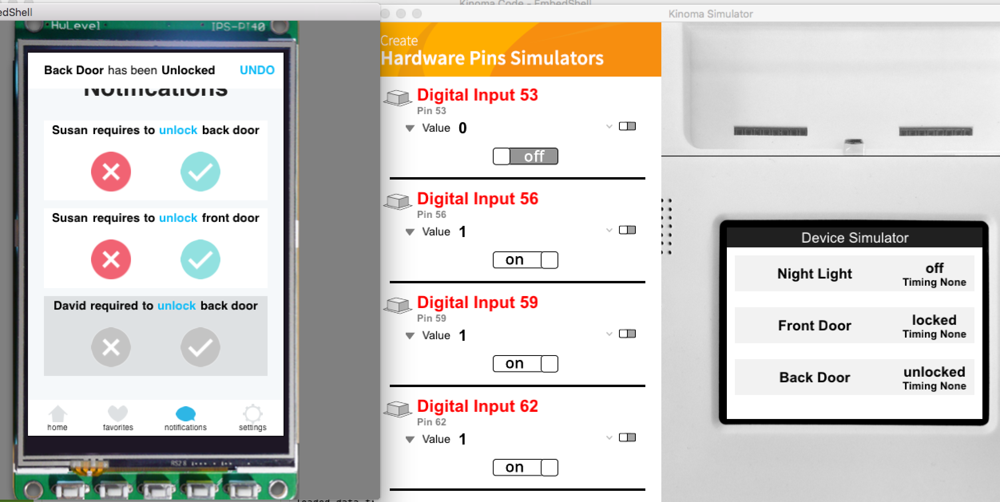
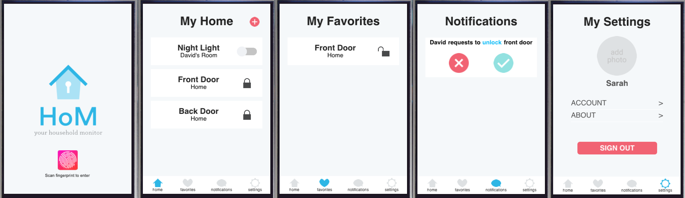
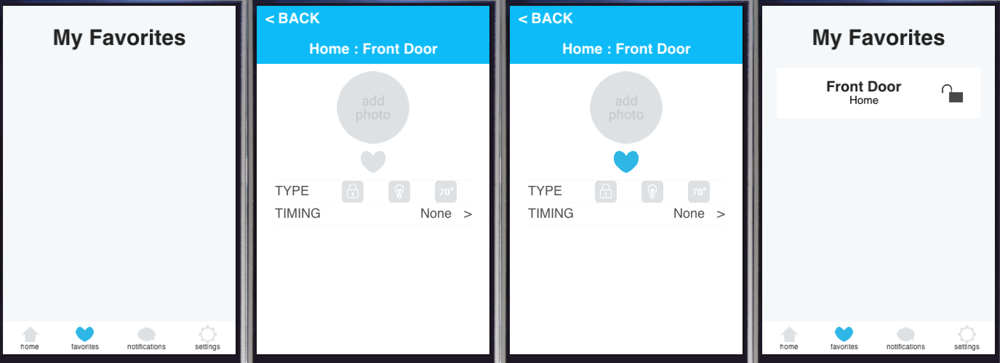
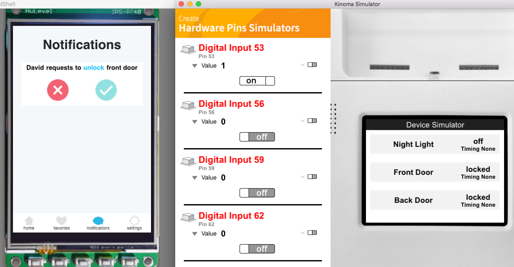
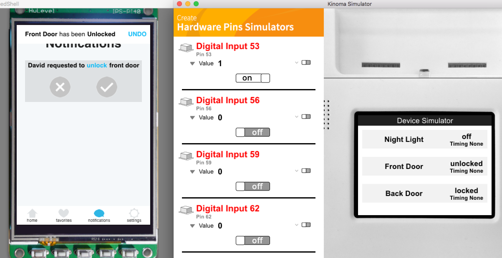
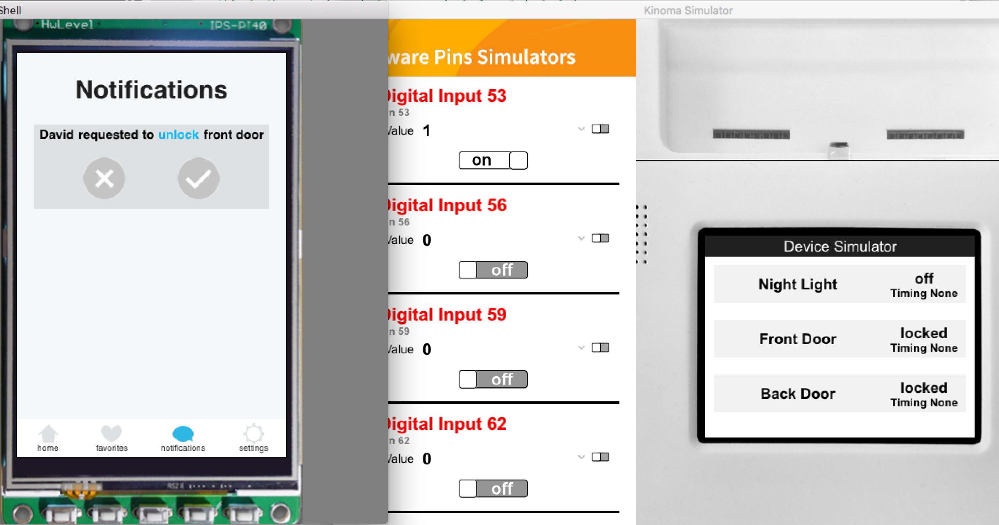
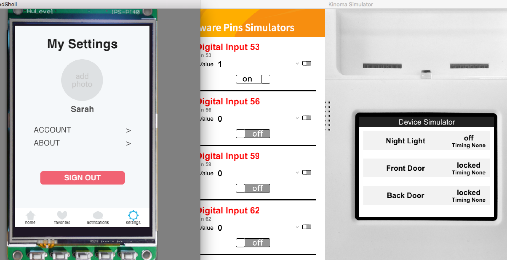
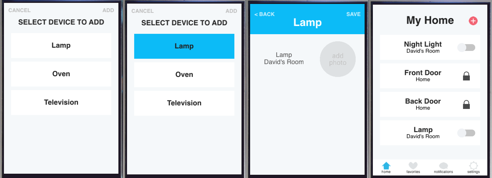
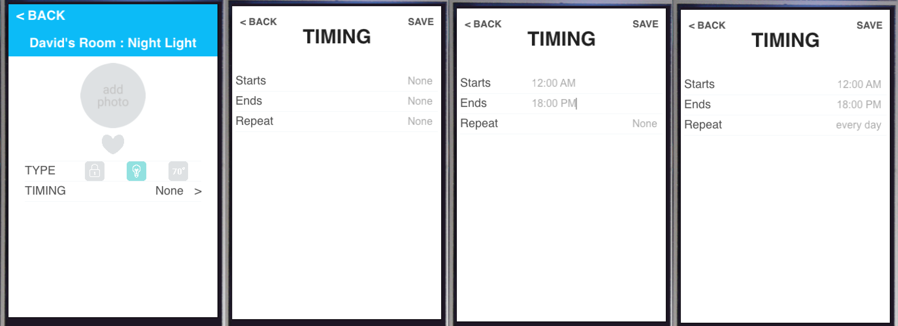

# Group-20-Project

### This is the group project of Team number 20.

* Group Members: Jacqueline Garcia, Jonya Chen, Jessica Kwon, Mohan Ganesan, Patricia (Zhiping) Xiao
* Project Name: HoM (Home Monitor)

##General Description: 
> This is a monitor that would help users control the smart devices at home. Users would be able to give commands through a mobile application, and their commands would be sent accurately to the devices at home, no matter where they are, as long as they are connected with the internet. Our APP is especially aimed at helping busy parents take care of everything and have a easier life.

##Tasks Description:
* Task 1 (Easy): User can turn a light on/off.
> A user can open the app and be presented with a list of household devices. The user can then toggle the on/off button for a device, like a light. For example, if the light is shown as “on” in the app, the user can then toggle the button to “off”, which will turn the actual light off. In our implementation, the Kinoma hardware device will display through a status message that the button has been toggled and the light can be manually turned off through the use of an LED.

* Task 2 (Medium): User can add a new device.
> A user can press the “add device” button on the mobile app’s home screen. The user will then be presented with a list of all possible devices that are available to be connected to. The user can then select which device he/she wants to add, hit the “Add” button, and then be brought back to the home screen. The user will then see that new specific device added to the list.

* Task 3 (Hard): User can set a timing for a device to turn on/off.
> A user can select a device on his/her homescreen list and then be brought to an “Edit” page. Once there, the user can click “Timing” in order to create a timing schedule for that particular device. The user can specify a start and end time for the device to turn on. In our implementation, the Kinoma hardware device will then display a message that shows that a timing schedule has been set for that device, along with which times have been specified. We can also use an analog input in order to simulate time changing that will then trigger a response at the specified times.

## Stage 0: Design

> Using [Figma](https://www.figma.com/file/gpUP6uhKAOyJVdrn4yxy7nEs/LOW-FIDELITY-MOCKUP) and [Invision](https://projects.invisionapp.com/share/MN93TI05V#/screens)
> 

## Stage 1: Interactive Prototype

> The Division of the Work: We have decided on the following work structure for this assignment - we're going to be working in phases (sequentially) to make sure that we're all on the same page and won't run into any conflicting code issues:
* Phase 1: Interface Redesign (try to consolidate all our screens so there are less transitions and modify some changes like getting rid of the group home page) - Jessica
* Phase 2: Backend & Code task 1 (turn a light on/off) - Mohan
* Phase 3: Layouts & Code task 2 (add a device) - Patricia
* Phase 4: Code task 3 (turn an oven on between 2 - 4 pm ) - Jacque
* Phase 5: Report write-up, presentation presentation, miscellaneous tasks - Jonya

Updates:

1. Jessica redesigned the interface ([Figma](https://www.figma.com/file/M1zJ6hF1zPVKDqP8ib8u8Xiu/HoM---v2))

2. Mo's and Patricia's part is done ([YouTube](https://youtu.be/150_U_h_4Tg))

3. Jacqueline's part is done and device simulator side's screen is updated, Jonya made the final video ([YouTube](https://youtu.be/eGW4OmLUgos))

## Stage 2: Improvement

> Note: You might be running into problem when trying to run our *companion-app* code the **SECOND** time. If that happens, go to your corresponding application preference folder. You could examine its exact location by printing out application.url in Kinoma Code. Plus, if you are a Mac user, it is under a hidden folder by default. If you want to make the hidden folders visible in finder, just copy & paste & run `defaults write com.apple.finder AppleShowAllFiles -boolean true ; killall Finder` in your terminal.

References:

* About the array: 

1. [push_front](http://stackoverflow.com/questions/8159524/javascript-pushing-element-at-the-beginning-of-an-array)

* About format:

1. [toString](http://www.w3schools.com/jsref/jsref_tostring_number.asp)
2. [Date](http://www.w3schools.com/js/js_date_methods.asp)

* Kinoma Reference:

1. [Cross-Device Basis](http://kinoma.com/develop/documentation/kinomajs-tutorials/cross-device-communication/)
2. [Pins Documentation](http://kinoma.com/develop/documentation/pins/)
3. [Pins Tutorial](http://kinoma.com/develop/documentation/getting-started-with-hardware/)
4. [Digital Tutorial](http://kinoma.com/develop/documentation/tutorials/digital/)
5. [Container Basis](http://kinoma.com/develop/documentation/javascript/)

Updates:

1. Basic Implementation ([Half-Way Narrated Video](https://youtu.be/HTvIWxtB3ic))

2. Image Corrected

3. Final Design

> We used Application sharing and discovery for communications about the devices' status, and used Pins sharing for communication.

")
")
")

> Filmed the [final video](https://youtu.be/TOnuw4eL4YA)

> Finished the [final report](https://medium.com/@jessicakwon/hom-your-household-monitor-6d515590e752#.llkxgew6i) together, typesetting and putting onto [medium](https://medium.com/) by [Jessica](https://medium.com/@jessicakwon)